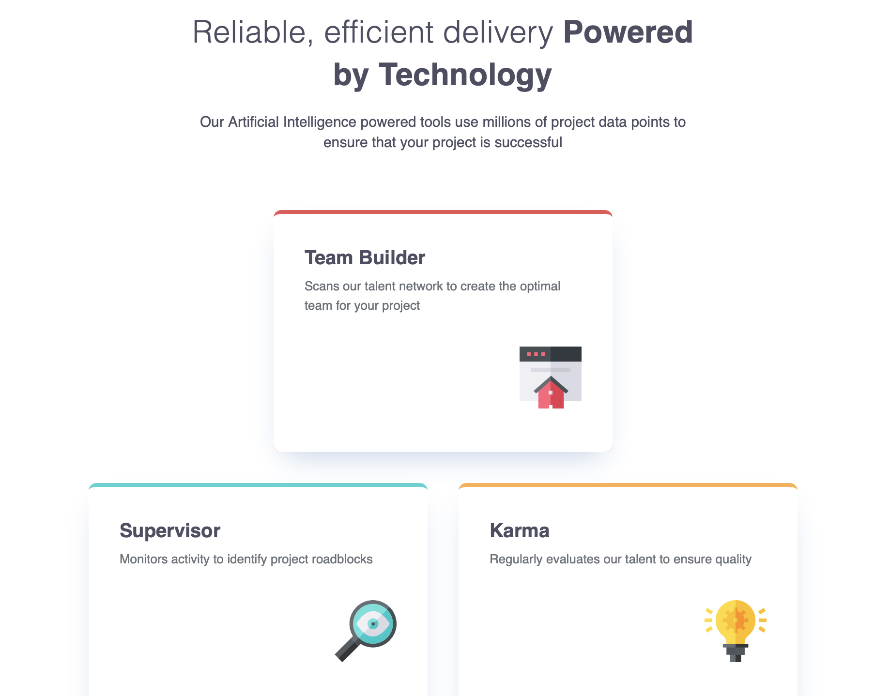

# Frontend Mentor - Four card feature section solution

This is a solution to the [Four card feature section challenge on Frontend Mentor](https://www.frontendmentor.io/challenges/four-card-feature-section-weK1eFYK). Frontend Mentor challenges help you improve your coding skills by building realistic projects.

## Table of contents

- [Overview](#overview)
  - [The challenge](#the-challenge)
  - [Screenshot](#screenshot)
  - [Links](#links)
- [My process](#my-process)
  - [Built with](#built-with)
  - [What I learned](#what-i-learned)
  - [Continued development](#continued-development)
- [Author](#author)
- [Acknowledgments](#acknowledgments)

## Overview

### The challenge

Users should be able to:

- View the optimal layout for the site depending on their device's screen size

### Screenshot



The above screenshot shows a tablet view with a min-width of 768 pixels.

### Links

- Live Site URL: [Four Card Feature](https://yohnaldana.github.io/fem-four-card-feature-section/)

## My process

### Built with

- Semantic HTML5 markup
- CSS custom properties
- Flexbox
- CSS Grid
- Mobile-first workflow

### What I learned

This project was my introduction to CSS Grid. Though I was able to complete this project I suspect there are easier ways to achieve the different views as the viewport's width changes. In the case of this project, there is mobile, tablet, and desktop widths. Each one with it's own distinct layout. One possibility of improving my solution would have been to combine what I have with grid-areas. This would have made it easier place items in the correct location as the layout changes by giving them labels.

The below is html code, with this project I tried to make the html as meaningful as possible and that meant writing semantic code. The individual cards I tried to make as semantic as possible:

```html
<div class="grid-container">
        <section class="card card__top-border-cyan supervisor">
          <h2 class="card-title">Supervisor</h2>
          <p class="card-paragraph">
            Monitors activity to identify project roadblocks
          </p>
          
        </section>
  <!-- more below -->
```

```css
/* Desktop: 1440px */
@media (min-width: 90rem) {
  .grid-container {
    grid-template-columns: repeat(3, auto);
    grid-template-rows: repeat(4, auto);
  }

  .supervisor {
    grid-column: 1 / 2;
    grid-row: 2 / 4;
  }

  .team-builder {
    grid-column: 2 / 3;
    grid-row: 1 / 3;
  }

  .karma {
    grid-column: 3 / 4;
    grid-row: 2 / 4; 
  }

  .calculator {
    grid-column: 2 / 3;
    grid-row: 3 / 5;
  }
}
```

Above is some CSS that quite easily adapts to desktop sized widths. After having built the website as mobile-first the later media queries became easy to write and overwrite the mobile styles written earlier in the source code.

### Continued development

CSS Grid is a great tool, there are areas however that I still need to improve on, among those are grid areas and creating grids that are uneven, meaning the grid cells can vary in width and or height compared to adjacent cells. This was the key problem in this project and though I was able to solve it using start-end spans (grid-column-start/end) I would like to understand this pattern more in depth. So I will be looking at this type of problem carefully to solve it more cleanly in the future.

## Author

- Frontend Mentor - [@yohnaldana](https://www.frontendmentor.io/profile/yohnaldana)

## Acknowledgments

Wesbos' excellent cssgrid course [find that here.]()
